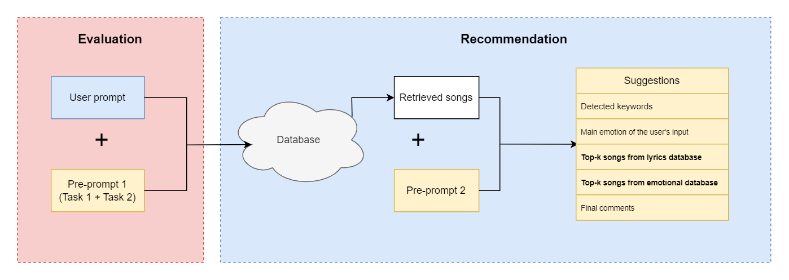

# ⭐️ Taylor's-Tune ⭐️
**Taylor's Tune** is a mood-driven music recommendations tool that leverages the newest cutting-edge open source **Large Language Models** (such as Mixtral-8x7b, Llama3-70b, Llama3-7b, Gemma-7b) to provide the best Taylor's Swift songs according to the user needs.

You can try it as a webapp [here](https://taylors-tune.streamlit.app/), while if you are more interested on the technical part you can read the [project report](docs/Taylor_Tunes_Project_Report.pdf).

## 📸 Screens
### 💬 Chat section
In this window the user can explain to the agent the emotional status and the relationship situation in order to get advices from it.
The subsection on the left offers the possibility to choose among the available models, as well as tuning some chat-hyperparameters such as *memory length, number of suggested songs and maximum LLM output tokens*.

### ❤️ Emotional questions section
This second panel allows the user to answer to the questionnaire proposed in *[I Knew You Were Trouble: Emotional Trends in the Repertoire of Taylor Swift
](https://arxiv.org/abs/2103.16737)*, with which songs suggestions are inferred using a statistical model.

### 📊 Emotional scores section
The third panel reports the two dataset used for the project.
The first one associates a textual description for each numerical emotional criterion score.  
The criteria considered are: *feelings of self, glass half full, stages of depression, tempo, seriousness, future prospects, feeling of male, togetherness*

The second one contains the lyrics, the emotional criteria, the meaning description and the spotify url of each song.

## 🔨 Setup and run

### Setup up the preliminary services
1. Create your own [Qdrant cluster](https://qdrant.tech/documentation/cloud/create-cluster/), then copy the the API key and the url
2. Get a [Groq API key](https://console.groq.com/docs/quickstart)

3. Create a `secrets.toml` file in this root folder file containing the following keys: `GROQ_API_KEY`, `QDRANT_API_KEY`, `QDRANT_CLIENT_URL`. Here you can better check out how [secrets work](https://docs.streamlit.io/deploy/streamlit-community-cloud/deploy-your-app/secrets-management)

Now you can choose either to install the local app on your current Python env/venv or to use the provided Dockerfile

### Option 1: Local installation

1. Copy the `secrets.toml` file in the apposite folder ([instructions here](https://docs.streamlit.io/deploy/streamlit-community-cloud/deploy-your-app/secrets-management)) 

2. Install the required packages with 
        
        pip3 install -r requirements.txt

3. Vectorize the datasets and upload them to your Qdrant vector DB by running the notebook `vector_db_upload.ipynb` 

4. Run the app with
        
        streamlit run 💬_Chat.py

### Option 2: Using Dockerfile

1. Build the app

        docker build -t taylor .

2. Vectorize the datasets and upload them to your Qdrant vector DB by running the notebook `vector_db_upload.ipynb` 

3. Run the app

        docker run -p 8501:8501 taylor

# Final notes / Open source
The project is fully open source and it can be extended also to other artists with some little tweaks. 
I will highly appreacite if someone wants to contribute to the project!

# Appendix

## System architecture

The webapp has been developed and hosted using [Streamlit](https://streamlit.io/) while the orchestration tool among vectorDBs and LLMs chosen is [Langchain](https://python.langchain.com/docs/get_started/introduction).

When a user send a prompt a first lyrical similarity search is performed, while at the same time the LLMs tries to predict the numerical scores for each criteria, according the first database illustrated in the `📊 Emotional scores` page. Subsequently a query to the criteria DBs for the best **k** songs is performed. Then, the two queries results are merged and provided as extra context to the LLM for the final suggestion. 

The system has been evaluated on the emotional decection capability and on the recommendation capability. More info about it in the [report](docs/Taylor_Tunes_Project_Report.pdf). 

## Useful notebooks
Useful notebooks:
- `vector_db_upload.ipynb` : allows to vectorize and upload the two provided databases to your existing Qdrant cluster
- `lyrics_summarization.ipynb` : get song's meaning description based on its lyrics